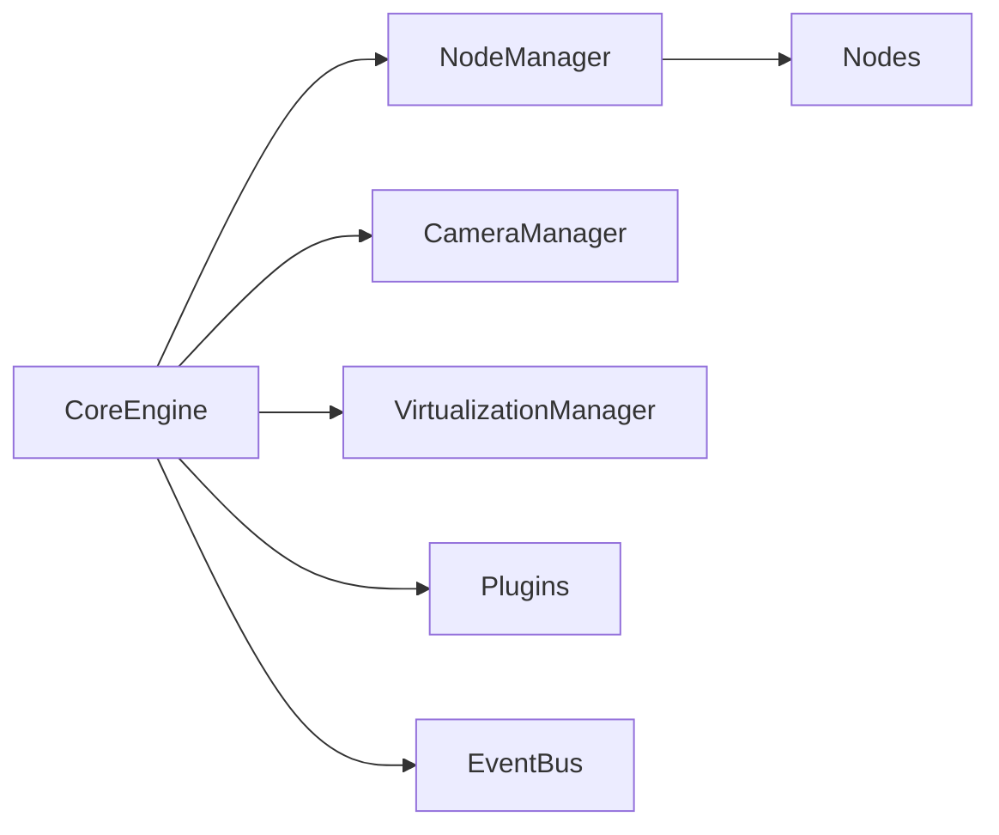

# Architecture

Flowscape Core SDK is built around a clear, modular architecture that separates responsibilities and makes it easy to extend.

## Overview

- **CoreEngine** — orchestrates the stage, layers, managers, and plugins
- **Managers** — domain-specific controllers (nodes, camera, virtualization)
- **Nodes** — typed wrappers around Konva primitives with a common base class
- **Plugins** — attachable features that enhance the engine
- **EventBus** — strongly-typed pub/sub for engine-wide events

## Rendering Model

- A single Konva `Stage` hosts layers.
- `NodeManager` owns a dedicated `Layer` and a `world` `Group` where all nodes are attached.
- `Grid` and similar visual helpers can render on their own layer to avoid camera transforms.

## Eventing

The `EventBus` enables decoupled communication. For example, `NodeManager` emits `node:created` when a node is added, and plugins or UI can subscribe to react.

## Extensibility

- Add new node types by extending `BaseNode`.
- Add features via `Plugin` with `onAttach` / `onDetach` lifecycle.
- Replace or enhance managers without changing the engine core.
